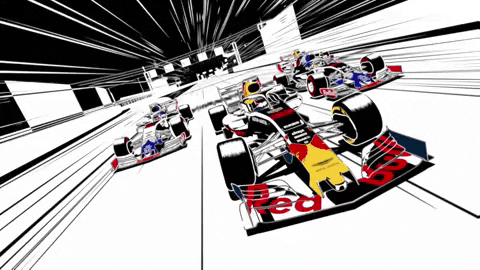
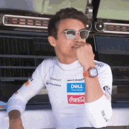
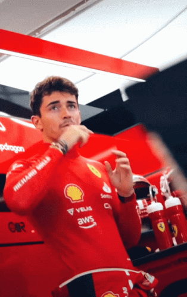
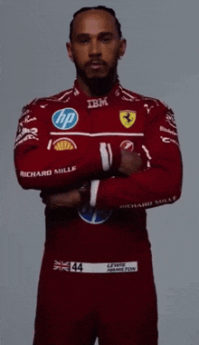
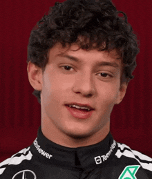

<h1>Formula 1</h1>

  <table>
        <tr>
            <td>
                
            </td>
            <td>
                <b>Objetivo:</b>
                
 Nosso desafio será criar uma lógica de um jogo de vídeo game para simular corridas de Formula 1, levando em consideração as regras e mecânicas abaixo.

            </td>
        </tr>
    </table>

<h2>Pilotos</h2>
      <table style="border-collapse: collapse; width: 800px; margin: 0 auto;">
        <tr>
            <td style="border: 1px solid black; text-align: center;">
                
Piastri

                
            </td>
            <td style="border: 1px solid black; text-align: center;">
                
Velocidade: 4

                
Manobrabilidade: 3

            </td>
             <td style="border: 1px solid black; text-align: center;">
                
Norris

                
            </td>
            <td style="border: 1px solid black; text-align: center;">
                
Velocidade: 3

                
Manobrabilidade: 4

            </td>
              <td style="border: 1px solid black; text-align: center;">
                
Leclerc

                
            </td>
            <td style="border: 1px solid black; text-align: center;">
                
Velocidade: 2

                
Manobrabilidade: 4

            </td>
        </tr>
        <tr>
            <td style="border: 1px solid black; text-align: center;">
                
Hamilton

                
            </td>
            <td style="border: 1px solid black; text-align: center;">
                
Velocidade: 5

                
Manobrabilidade: 2

            </td>
            <td style="border: 1px solid black; text-align: center;">
                
Bortoletto

                
            </td>
            <td style="border: 1px solid black; text-align: center;">
                
Velocidade: 3

                
Manobrabilidade: 4

            </td>
            <td style="border: 1px solid black; text-align: center;">
                
Kimi Antolelli

                
            </td>
            <td style="border: 1px solid black; text-align: center;">
                
Velocidade: 2

                
Manobrabilidade: 2

            </td>
        </tr>
    </table>

<h3>🕹️ Regras & mecânicas:</h3>

<b>Pilotos:</b>

<input type="checkbox" id="pilotos-item" />
<label for="pilotos-item">O Computador deve receber dois pilotos para disputar a corrida</label>

<b>Pistas:</b>

<ul>
  <li><input type="checkbox" id="pistas-1-item" /> <label for="pistas-1-item">Os pilotos irão correr em uma pista aleatória de 10 voltas</label></li>
  <li><input type="checkbox" id="pistas-2-item" /> <label for="pistas-2-item">A cada volta, será sorteado um bloco da pista que pode ser uma reta ou curva</label>
    <ul>
      <li><input type="checkbox" id="pistas-2-1-item" /> <label for="pistas-2-1-item">Caso o bloco da pista seja uma RETA, o piloto deve jogar um dado de 6 lados e somar o atributo VELOCIDADE, quem vencer ganha um ponto</label></li>
      <li><input type="checkbox" id="pistas-2-2-item" /> <label for="pistas-2-2-item">Caso o bloco da pista seja uma CURVA, o piloto deve jogar um dado de 6 lados e somar o atributo MANOBRABILIDADE, quem vencer ganha um ponto</label></li>
      <li><input type="checkbox" id="pistas-2-3-item" /> <label for="pistas-2-3-item">Nenhum piloto pode ter pontuação negativa (valores abaixo de 0)</label></li>
    </ul>
  </li>
</ul>

<b>Condição de vitória:</b>

<input type="checkbox" id="vitoria-item" />
<label for="vitoria-item">Vence a corrida quem acumulou mais pontos</label>
